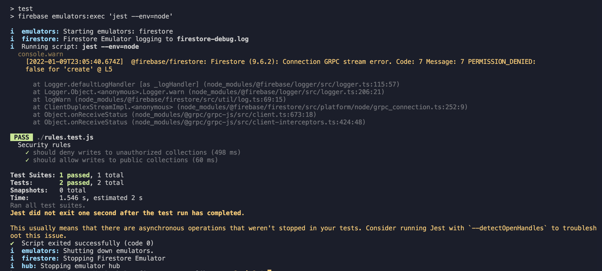

# Reproduction of `Connection GRPC stream error`

This is a sample project that reproduces the following problems with `@firebase/@firebase/rules-unit-testing@2.0.1`.

1. `Connection GRPC stream error` is logged for every run.

2. Jest test script does not exit after execution. Jest shows the following messages:
    > Jest did not exit one second after the test run has completed.
    >
    > This usually means that there are asynchronous operations that weren't stopped in your tests.

The problems are reported at https://github.com/firebase/firebase-js-sdk/issues/5872

## How to run

### `npm test`

This executes the following script:

> firebase emulators:exec 'jest --env=node'

The above script starts Firestore emulator at port `8080`.

## `rules.test.js`

This test file contains two test cases, both of which should pass. One uses `assertFails` and the other `assertSucceeds`.
It uses version 9 JavaScript SDK.

## Console output

## Environment

- macOS Big Sur: v11.5.1
- node: v.14.17.0
- @firebase/rules-unit-testing: v2.0.1
- firebase v9.6.2
- jest: v27.4.7